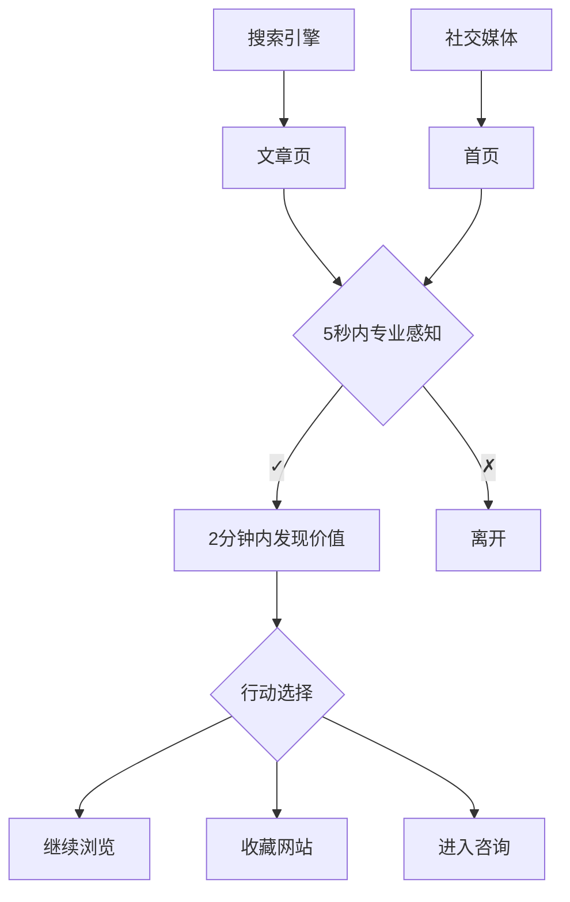
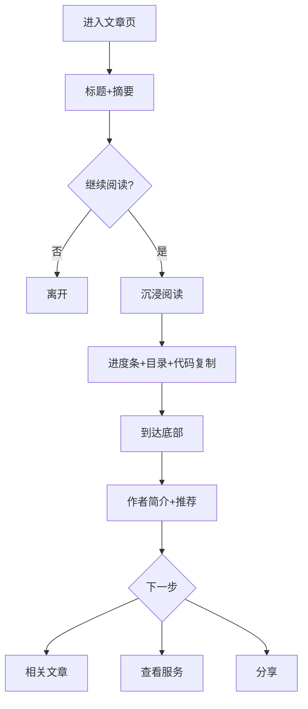

# UX Design Specification: leon-blog

**Author:** Leon  
**Date:** 2025-12-23

---

## Executi2d sa f

### Project Vision

leon-blog 是一个"转型者叙事"驱动的个人品牌平台，展示 Leon 从"全栈开发者"到"技术商人"的进化路径。通过 Build in Public 的透明化内容，为 IT 从业者、技术管理者和企业管理者提供 AI 时代的实战经验和咨询服务入口。

**核心定位**：专业、透明、可信赖的 AI 效能专家

**参考风格**：benx.ai — 极简专业、白+蓝色调、清晰信息层级

---

### Target Users

#### Primary Personas

| 用户类型 | 画像 | 核心需求 | 阅读深度 | 设备偏好 | 转化路径 |
|---------|------|---------|---------|---------|---------|
| **IT从业者** | 小王，28岁，前端开发 | 学习AI编程、复用案例 | 深度阅读 | 桌面70% | 订阅→关注→社区 |
| **技术管理者** | 张总，35岁，技术经理 | 团队AI转型方案 | 中度浏览 | 桌面60%+移动40% | 案例→服务→咨询 |
| **企业管理者** | 李总，42岁，COO | 快速评估专业性、ROI | 快速扫描 | 移动60% | 首页→服务→联系 |

#### Secondary Personas

| 用户类型 | 说明 | 价值 |
|---------|------|------|
| **内容创作者** | 同行，来参考/学习 | 潜在合作伙伴 |
| **潜在合作伙伴** | 寻求联名/合作 | 高价值但低频 |

---

### Conversion Funnel Expectations

| 来源 | 阅读率 | 订阅率 | 咨询率 |
|------|--------|--------|--------|
| 搜索来客 | 60% | 5% | 1% |
| 推荐来客 | 80% | 20% | 10% |

---

### Key Design Challenges

1. **多层次用户需求**：三类用户对内容深度和形式的需求差异显著
2. **阅读深度分化**：IT从业者需要深度技术内容，管理者需要快速要点
3. **转化路径设计**：从"内容消费"到"咨询意向"的转化需要精心设计
4. **品牌记忆建立**：首次访客如何记住这个网站并愿意回访
5. **移动端适配**：代码块、长文章在移动端的阅读体验

---

### Design Opportunities

1. **分层内容架构**：TL;DR → 正文 → 深入链接，满足不同深度需求
2. **数据化信任**：量化项目成果，用数字建立即时信任
3. **低门槛转化**："免费初聊"文案，降低咨询心理门槛
4. **暗色模式差异化**：极致的开发者友好暗色体验
5. **极简+个性**：在 benx.ai 极简风格基础上注入个人特色元素

---

## UX Discovery Insights

### UX Pain Points (Priority)

#### P0 Critical

| 问题 | 影响用户 | UX解决方案 |
|------|---------|-----------|
| 代码块无复制按钮 | IT从业者 | 添加一键复制 + 反馈提示 |
| 搜索框不明显 | 所有用户 | 导航栏固定搜索入口 |
| 电话不可点击 | 管理者 | tel: 链接必须生效 |
| 首屏定位不清 | 首次访客 | 明确tagline + 内容入口 |
| 移动端加载慢 | 管理者 | 图片优化 + 懒加载 < 3秒 |

#### P1 High

| 问题 | 影响用户 | UX解决方案 |
|------|---------|-----------|
| 服务入口隐蔽 | 技术管理者 | 导航栏明确"服务" |
| 咨询表单过长 | 管理者 | 简化为3字段 |
| 无内容推荐 | 首次访客 | 首页展示热门文章 |
| 二维码太小 | 移动用户 | 点击放大功能 |

---

### UX First Principles

1. **流量意图匹配**
   - 搜索来客 → 先看内容价值
   - 推荐来客 → 先看人格信任
   - 首页需同时满足两种路径

2. **摩擦与阶段匹配**
   - 初期（求量）→ 最低摩擦联系（微信直联 > 表单）
   - 成长期（求质）→ 分步筛选

3. **暗色模式=身份信号**
   - 不只是功能，是"你懂我"的握手礼
   - 暗色要做到极致，默认或自动检测

4. **TL;DR=决策工具**
   - 不是摘要，是"为什么你应该关心"
   - 格式：问题 + 方案 + 结果

---

### TL;DR Schema Standard

```yaml
tldr:
  problem: "用户面临的问题"
  solution: "本文提供的方案要点"
  result: "预期结果/收获"
```

---

### Edge Case Requirements

#### 渐进增强策略

- 核心内容（文章、服务）不依赖JavaScript
- 增强功能有JS时更好，无JS时优雅降级
- 暗色模式：CSS自动检测 + JS手动切换

#### 性能预算

| 指标 | 目标 |
|------|------|
| 首屏加载 | < 3秒（3G网络） |
| LCP | < 2秒 |
| FID | < 100ms |
| CLS | < 0.1 |

#### 响应式标准

| 标准 | 要求 |
|------|------|
| 最小宽度 | 320px |
| 触摸目标 | ≥ 44×44px |
| 代码块 | 横向滚动 + 滚动提示 |

#### 无障碍标准

- WCAG 2.1 AA
- 键盘完全可导航
- 屏幕阅读器友好
- 颜色对比度 ≥ 4.5:1

#### "董事会就绪"设计

- 首屏即时可信
- 无弹窗干扰
- 数据可视化
- 可独立分享的服务/案例页面
- 使用 Vercel Analytics（无cookie）

---

### First Principles Framework

**核心公式**：
```
网站成功 = Σ (用户价值 × 信任系数 × 行动便利度)
```

**设计层次**：

| 层次 | 目标 | 核心元素 |
|------|------|---------|
| **Layer 1: 价值展示** | 3秒内证明"值得看" | 首屏价值主张、热门内容、数据证明 |
| **Layer 2: 内容消费** | 深度价值 + 效率呈现 | 博客系统、TL;DR、代码体验 |
| **Layer 3: 信任积累** | 人格+能力+社会三重信任 | 个人故事、案例研究、客户评价 |
| **Layer 4: 行动转化** | 最低摩擦的行动路径 | 服务介绍、低摩擦联系、订阅机制 |

**关键决策**：

1. 借鉴benx.ai**效果**（专业感），不盲目模仿形式
2. 博客是**信任基础设施**，服务是**变现核心**
3. 内容消费**桌面优化**，转化路径**移动优先**
4. 每篇内容的隐含目标：价值→信任→暗示→行动

---

## Core User Experience

### Defining Experience

**核心用户行为**：阅读博客文章（内容消费）→ 建立信任 → 联系咨询（价值转化）

**核心体验公式**：
```
优秀体验 = 快速找到价值 + 无摩擦消费 + 自然转化
```

**体验优先级**：

| 优先级 | 核心行为 | 体验目标 |
|--------|---------|---------|
| P0 | 阅读博客文章 | 沉浸、高效、无干扰 |
| P0 | 联系咨询 | 一步到位、零门槛 |
| P1 | 搜索内容 | 即时响应、结果精准 |
| P1 | 复制代码 | 一键完成、无行号 |
| P2 | 切换主题 | 无闪烁、记住偏好 |
| P2 | 订阅更新 | 简单、不打扰 |

---

### Platform Strategy

| 维度 | 决策 | 理由 |
|------|------|------|
| **平台** | Web-only | 个人博客无需原生App |
| **渲染** | SSG | 性能最优、SEO友好 |
| **框架** | Next.js App Router | 现代化、Vercel原生支持 |
| **交互** | 桌面键鼠 + 移动触控 | 两种模式都需优化 |
| **离线** | 不需要 | 无离线刚需 |
| **PWA** | 可选 | 非MVP |

**设备策略**：

| 设备 | 核心场景 | 优化重点 |
|------|---------|---------|
| 桌面 | 深度阅读、代码学习 | 代码体验、目录导航 |
| 平板 | 碎片阅读、会议演示 | 响应式布局 |
| 手机 | 快速浏览、转化行动 | 加载速度、联系便捷 |

---

### Effortless Interactions

**必须做到"零思考"的交互**：

| 交互 | 目标体验 | 实现方式 |
|------|---------|---------|
| **阅读文章** | 打开即读 | 无弹窗、无广告、无强制登录 |
| **复制代码** | 一键可用 | 复制按钮 + 去行号 + 反馈 |
| **切换主题** | 瞬间无闪 | next-themes + script注入 |
| **联系咨询** | 看到即联系 | 微信常驻 + tel:链接 |
| **搜索内容** | 输入即结果 | Pagefind + 键盘快捷键 |
| **订阅更新** | 一个输入框 | 只需邮箱 |

**消除的摩擦**：

| 竞品常见摩擦 | 我们的做法 |
|-------------|-----------|
| 强制登录 | ❌ 不做 |
| 弹窗订阅 | ❌ 不做 |
| Cookie横幅 | ❌ 用Vercel Analytics |
| 复杂表单 | 简化为3字段 |

---

### Critical Success Moments

**用户"Aha!"时刻**：

| 时刻 | 触发场景 | 设计要点 |
|------|---------|---------|
| **价值发现** | 首次访问3秒内 | 首屏价值主张 + 热门内容 |
| **效率惊喜** | 看到TL;DR | 3句话摘要显眼前置 |
| **专业信任** | 看到量化成果 | 数字证明（10x等） |
| **代码可用** | 一键复制成功 | 复制按钮 + 成功反馈 |
| **联系顺畅** | 扫码/拨号成功 | 二维码清晰 + tel:可点 |

**Make-or-Break Flows**：

| 流程 | 失败后果 | 成功标准 |
|------|---------|---------|
| 首次加载 | 离开 | < 2秒LCP |
| 文章阅读 | 不再来 | 沉浸无干扰 |
| 代码复制 | 开发者流失 | 一键成功 |
| 咨询转化 | 商业损失 | 最低摩擦 |

---

### Experience Principles

**6条核心体验原则**：

| # | 原则 | 说明 |
|---|------|------|
| 1 | **内容为王** | 一切设计服务于内容消费 |
| 2 | **速度即体验** | 快就是好体验的基础 |
| 3 | **零摩擦联系** | 联系应该一步到位 |
| 4 | **信任前置** | 先证明价值再求转化 |
| 5 | **开发者优先** | 暗色模式、代码体验 |
| 6 | **移动友好** | 管理者常用手机 |

---

## Desired Emotional Response

### Primary Emotional Goals

| 情感 | 说明 | 设计支撑 |
|------|------|---------|
| **专业信任** | "这个人真的很专业" | 量化成果、真实案例、透明经历 |
| **共鸣归属** | "他懂我/我们是同类人" | 暗色模式、开发者语言、转型叙事 |
| **高效收获** | "没浪费我的时间" | TL;DR、清晰结构、可用代码 |
| **期待连接** | "我想和这个人聊聊" | 亲切语调、低门槛联系、价值暗示 |

---

### Emotional Journey Map

| 阶段 | 触点 | 期望情感 | 设计要点 |
|------|------|---------|---------|
| **发现** | 搜索/推荐链接 | 好奇 → 专业感 | 清晰标题、专业预览图 |
| **首印** | 首屏3秒 | 惊艳 → 信任 | 简洁设计、价值主张、数据证明 |
| **浏览** | 导航探索 | 掌控 → 发现 | 清晰架构、推荐内容 |
| **阅读** | 文章消费 | 沉浸 → 收获 | 无干扰、TL;DR、代码可用 |
| **评估** | 服务/案例页 | 考量 → 信任 | 流程透明、定价范围、成功案例 |
| **行动** | 联系咨询 | 决心 → 安心 | 简单表单、即时反馈、预期说明 |
| **等待** | 等待回复 | 期待 → 被重视 | 自动回复、时间预期 |
| **回访** | 再次访问 | 熟悉 → 持续价值 | 新内容、主题记忆 |

---

### Micro-Emotions Design

| 情感对 | 目标 | 设计实现 |
|--------|------|---------|
| 信任 vs 怀疑 | 信任 | 真实头像、量化成果、客户评价 |
| 高效 vs 困惑 | 高效 | TL;DR、搜索、清晰导航 |
| 归属 vs 疏离 | 归属 | 暗色模式、开发者语言 |
| 掌控 vs 焦虑 | 掌控 | 进度指示、明确预期 |
| 惊喜 vs 平淡 | 惊喜 | 代码一键可用、超预期内容 |

---

### Emotions to Avoid

| 负面情感 | 预防措施 |
|---------|---------|
| 烦躁 | 无弹窗、无强制订阅、无广告 |
| 怀疑 | 数据化表达、真实案例、透明经历 |
| 迷失 | 清晰导航、搜索功能、面包屑 |
| 失望 | 性能优化、代码测试、内容质量 |
| 被忽视 | 自动回复、时间预期、跟进机制 |

---

### Emotional Design Principles

| # | 原则 | 说明 |
|---|------|------|
| 1 | **真诚胜于完美** | 透明的失败经历比完美的成功更建立信任 |
| 2 | **效率即尊重** | 节省用户时间是最大的情感投资 |
| 3 | **共鸣创造归属** | 开发者身份认同带来天然亲近 |
| 4 | **惊喜制造传播** | 超预期的小细节触发分享欲 |
| 5 | **预期管理安心** | 明确告知下一步减少焦虑 |

---

## UX Pattern Analysis & Inspiration

### Inspiring Products Analysis

#### 1. benx.ai（主要参考）

| 维度 | 分析 | 借鉴价值 |
|------|------|---------|
| **核心问题** | 个人品牌展示 + 咨询获客 | 与目标一致 |
| **视觉设计** | 极简白+蓝、充足留白 | 信任建立 |
| **信息层级** | Hero → 服务 → 项目 → 博客 | 清晰导航 |
| **咨询入口** | 微信二维码始终可见 | 低摩擦转化 |

**借鉴**：首屏结构、服务卡片、项目展示

#### 2. leerob.io（技术实现参考）

| 维度 | 分析 | 借鉴价值 |
|------|------|---------|
| **视觉设计** | 黑白极简、暗色默认 | 开发者友好 |
| **博客体验** | 阅读时间、Views、RSS | 内容消费 |
| **技术栈** | Next.js App Router、Vercel | 直接复用 |

**借鉴**：暗色模式实现、文章页结构、订阅机制

#### 3. joshwcomeau.com（体验标杆）

| 维度 | 分析 | 借鉴价值 |
|------|------|---------|
| **代码体验** | 交互式沙盒、实时预览 | 体验标杆 |
| **阅读体验** | 目录导航、进度条 | 长文章参考 |

**借鉴**：代码复制按钮、目录导航、阅读进度

#### 4. 阮一峰博客（内容策略）

| 维度 | 分析 | 借鉴价值 |
|------|------|---------|
| **设计理念** | 内容为王、极简风格 | 内容优先 |
| **更新策略** | 周更、稳定输出 | 内容策略 |

**借鉴**：设计服务于内容，不喧宾夺主

---

### Transferable UX Patterns

#### 导航模式

| 模式 | 来源 | 适用场景 |
|------|------|---------|
| 固定顶部导航 | benx.ai | 全站通用 |
| 侧边目录 | joshwcomeau | 长文章 |
| 汉堡菜单 | 移动端通用 | 移动端 |

#### 交互模式

| 模式 | 来源 | 适用场景 |
|------|------|---------|
| 一键复制 | joshwcomeau | 代码块 |
| 暗色切换 | leerob.io | 全站 |
| 即时搜索 | Pagefind | 内容搜索 |

#### 视觉模式

| 模式 | 来源 | 适用场景 |
|------|------|---------|
| 卡片布局 | benx.ai | 服务/项目 |
| 数据高亮 | benx.ai | 成果展示 |

---

### Anti-Patterns to Avoid

| 反模式 | 为什么避免 |
|--------|-----------|
| 强制订阅弹窗 | 破坏阅读沉浸 |
| 过多动效 | 影响性能 |
| 复杂表单 | 增加转化摩擦 |
| 无暗色模式 | 开发者不友好 |
| 自动播放 | 引发反感 |
| 隐藏联系方式 | 错失转化 |

---

### Design Inspiration Strategy

#### What to Adopt（直接采用）

| 模式 | 来源 | 理由 |
|------|------|------|
| 极简专业风格 | benx.ai | 符合信任目标 |
| 暗色模式默认 | leerob.io | 开发者信号 |
| 一键代码复制 | joshwcomeau | 核心需求 |
| 固定联系入口 | benx.ai | 转化必需 |

#### What to Adapt（适配修改）

| 模式 | 如何修改 |
|------|---------|
| 代码沙盒 | 简化为静态高亮 + 复制 |
| 丰富动效 | 保留关键，减少花哨 |
| 首页结构 | 增加热门内容入口 |

#### What to Avoid（明确不做）

| 模式 | 理由 |
|------|------|
| 订阅弹窗 | 与情感目标冲突 |
| 复杂动画 | 性能优先 |
| Cookie横幅 | 用Vercel Analytics |
| 评论系统 | 维护成本高 |

---

### Visual Direction Summary

**整体风格**：benx.ai极简专业 + leerob.io暗色开发者感

**色彩方向**：
- 主色：专业蓝（#2563EB）
- 暗色背景：深蓝灰（#0F172A）
- 文字：高对比度黑/白

**字体方向**：
- 正文：Inter / Noto Sans SC
- 代码：JetBrains Mono

**交互风格**：简洁、快速响应、避免过度动画

---

## Design System Foundation

### Design System Choice

**选择**：Tailwind CSS + shadcn/ui

| 组成 | 技术 | 说明 |
|------|------|------|
| CSS框架 | Tailwind CSS v3.4+ | 原子化CSS |
| 组件库 | shadcn/ui | 按需复制组件 |
| 图标 | Lucide Icons | 轻量Tree-shakable |
| 主题 | next-themes | 暗色模式切换 |
| 代码高亮 | Shiki | 构建时语法高亮 |

---

### Rationale for Selection

| 决策因素 | shadcn/ui优势 |
|---------|--------------|
| **开发速度** | 高质量组件开箱即用 |
| **可定制性** | 代码复制到项目，完全可控 |
| **暗色模式** | CSS变量，与next-themes无缝 |
| **性能** | 零运行时，纯CSS |
| **维护性** | 代码在项目中，独立于外部依赖 |

---

### Design Token Specification

**颜色系统**：

```css
:root {
  --primary: 221.2 83.2% 53.3%;      /* 专业蓝 #2563EB */
  --background: 0 0% 100%;
  --foreground: 222.2 84% 4.9%;
  --radius: 4px;
}

.dark {
  --primary: 217.2 91.2% 59.8%;
  --background: 222.2 84% 4.9%;      /* 深蓝灰 #0F172A */
  --foreground: 210 40% 98%;
}
```

**圆角系统**（更专业）：

| Token | 值 | 用途 |
|-------|-----|------|
| --radius-sm | 2px | 小按钮、标签 |
| --radius-md | 4px | 卡片、输入框 |
| --radius-lg | 8px | 大卡片、模态框 |

**字体系统**：

```css
--font-sans: 'Inter', 'Noto Sans SC', system-ui, sans-serif;
--font-mono: 'JetBrains Mono', 'Fira Code', monospace;
```

---

### Component Strategy

#### shadcn/ui 组件（直接使用）

```bash
# MVP必装组件
npx shadcn-ui@latest add button card input label
npx shadcn-ui@latest add navigation-menu sheet
npx shadcn-ui@latest add toast dialog
```

| 组件 | 用途 |
|------|------|
| Button | 按钮、CTA |
| Card | 服务卡片、项目卡片 |
| Input/Label | 表单输入 |
| NavigationMenu | 顶部导航 |
| Sheet | 移动端菜单 |
| Toast | 操作反馈 |
| Dialog | 弹窗（搜索等） |

#### 自建组件（shadcn不提供）

| 组件 | 用途 | 复杂度 | 技术方案 |
|------|------|--------|---------|
| CodeBlock | 代码高亮+复制 | 中 | Shiki + 自定义 |
| TocNav | 目录导航 | 中 | 解析MDX标题 |
| ReadingProgress | 阅读进度条 | 低 | 滚动监听 |
| SearchModal | 搜索弹窗 | 中 | Pagefind + Dialog |
| ContactCard | 微信二维码 | 低 | 图片+放大 |
| PostCard | 文章卡片 | 低 | 组合Card |
| ServiceCard | 服务卡片 | 低 | 组合Card |

---

### Brand Differentiation Strategy

**避免"AI博客既视感"**：

| 维度 | 默认shadcn | 我们的定制 |
|------|-----------|-----------|
| 主色 | 紫色 | 专业蓝 |
| 圆角 | 6-8px | 2-4px（更锐利） |
| 暗色背景 | 纯黑 | 深蓝灰 |
| 字体 | 系统默认 | Inter + Noto Sans SC |

**差异化要点**：
1. 专业蓝而非紫色 — 商务感
2. 小圆角 — 锐利专业
3. 深蓝灰而非纯黑 — 更柔和
4. 中英混排优化 — 阅读体验

---

### Dependencies Lock

```json
{
  "tailwindcss": "^3.4.0",
  "@radix-ui/react-dialog": "^1.0.5",
  "lucide-react": "^0.300.0",
  "next-themes": "^0.2.1",
  "shiki": "^1.0.0",
  "class-variance-authority": "^0.7.0",
  "clsx": "^2.0.0",
  "tailwind-merge": "^2.0.0"
}
```

---

## Defining Core Experience

### Defining Experience Statement

**核心定义**："2分钟内，从一篇文章摘要中，看到完整的道-法-术-器闭环，立即知道下一步该做什么"

**三重核心交互**：
1. **阅读体验 (A)** — 文章好读、代码清晰、干货密集
2. **信任建立 (C)** — 第一眼就觉得专业可靠
3. **行动驱动 (D)** — 看完就知道下一步做什么

---

### User Mental Model

**用户当前状态**：
- 信息来源：技术博客 + 付费课程
- 核心痛点：太理论不落地、太碎片不系统
- 期望：完整的方法论闭环

**认知转变路径**：

```
困惑状态 → 寻找信息 → 碎片/理论 → 仍然困惑
              ↓
         发现本站 → 道-法-术-器闭环 → 知道下一步
```

---

### Success Criteria

| 时间节点 | 成功标准 |
|---------|---------|
| 5秒 | 感知专业性，建立初步信任 |
| 30秒 | 理解文章核心价值 |
| 2分钟 | 看到道-法-术-器结构，感受系统性 |
| 读完 | 明确知道下一步该做什么 |

---

### Pattern Strategy

**成熟模式（降低学习成本）**：
- 顶部导航 + 分类标签
- 左目录 + 右正文
- 语法高亮 + 一键复制
- 全文搜索弹窗

**创新模式（核心差异化）**：
- 道-法-术-器内容分层
- Build in Public 透明化叙事
- 从执行者到构建者的转型视角

---

### Experience Mechanics

**1. Initiation (入口)**
- 触发：搜索引擎 / 社交媒体分享
- 落地：具体文章页

**2. First Impression (0-5秒)**
- 视觉：专业整洁，无干扰
- 信任：清晰的作者信息
- 引导：明确的文章主题

**3. Core Reading (30秒-2分钟)**
- 摘要：核心观点一目了然
- 结构：道-法-术-器分层可见
- 代码：高亮清晰，可复制

**4. Aha Moment (2分钟)**
- 认知："这是系统方法，不是碎片"
- 情感："这个人和我一样在探索"
- 信任："值得继续了解"

**5. Action Trigger (读完后)**
- 继续阅读完整文章
- 尝试文章中的工具/方法
- 订阅获取更多内容
- 预约咨询深入了解

---

## Visual Design Foundation

### Color System

**Primary Palette**

| Token | Light | Dark | Usage |
|-------|-------|------|-------|
| --primary | #2563EB | #3B82F6 | 主要CTA、链接 |
| --primary-hover | #1D4ED8 | #60A5FA | 悬停状态 |
| --primary-muted | #DBEAFE | #1E3A5F | 背景高亮 |

**Neutral Palette**

| Token | Light | Dark | Usage |
|-------|-------|------|-------|
| --background | #FFFFFF | #0F172A | 页面背景 |
| --surface | #F8FAFC | #1E293B | 卡片背景 |
| --border | #E2E8F0 | #334155 | 边框 |
| --text-primary | #0F172A | #F8FAFC | 标题正文 |
| --text-secondary | #64748B | #94A3B8 | 次要文字 |
| --text-muted | #94A3B8 | #64748B | 辅助信息 |

**Semantic Colors**

| Token | Value | Usage |
|-------|-------|-------|
| --success | #10B981 | 成功状态 |
| --warning | #F59E0B | 警告提示 |
| --error | #EF4444 | 错误状态 |
| --info | #3B82F6 | 信息提示 |

---

### Typography System

**Font Families**

```css
--font-sans: 'Inter', 'Noto Sans SC', system-ui, sans-serif;
--font-mono: 'JetBrains Mono', 'Fira Code', monospace;
```

**Type Scale**

| Level | Desktop | Mobile | Line Height |
|-------|---------|--------|-------------|
| Display | 48px | 36px | 1.1 |
| H1 | 36px | 28px | 1.2 |
| H2 | 28px | 22px | 1.3 |
| H3 | 22px | 18px | 1.4 |
| Body | 18px | 16px | 1.75 |
| Small | 14px | 14px | 1.5 |
| Code | 15px | 14px | 1.6 |

---

### Spacing & Layout

**Spacing Scale (8px base)**

| Token | Value | Usage |
|-------|-------|-------|
| --space-1 | 4px | 紧密元素 |
| --space-2 | 8px | 元素内边距 |
| --space-3 | 12px | 小组件间距 |
| --space-4 | 16px | 组件内边距 |
| --space-6 | 24px | 组件间距 |
| --space-8 | 32px | 区块内边距 |
| --space-12 | 48px | 区块间距 |
| --space-16 | 64px | 大区块间距 |
| --space-24 | 96px | 页面区块分隔 |

**Layout Widths**

| Context | Max Width |
|---------|-----------|
| Reading Content | 720px |
| Page Container | 1200px |
| Full Width | 100% |

**Layout Principles**

1. **呼吸感优先** — 大量留白，段落间距24px，区块间距64-96px
2. **内容居中** — 正文居中对齐，最大720px宽度
3. **视觉层次** — 用间距和背景色分隔，极简阴影

---

### Accessibility Considerations

| 要求 | 标准 |
|------|------|
| 对比度 | WCAG 2.1 AA (4.5:1 正文, 3:1 大字) |
| 字号 | 最小16px正文 |
| 焦点状态 | 清晰可见的焦点环 |
| 颜色独立 | 不仅靠颜色传达信息 |
| 暗色模式 | 完整支持，自动检测+手动切换 |

---

## Design Direction Decision

### Design Directions Explored

探索了6种设计方向：
1. **极简纯净** — Apple风格，大留白
2. **卡片矩阵** — 模块化网格
3. **单列叙事** — 垂直滚动故事
4. **左右分割** — 侧边栏+内容区
5. **全宽沉浸** — 大Hero视觉冲击
6. **benx.ai风格** — 信息丰富模块化

**用户偏好**：1、3、5、6 吸引力最强

### Chosen Direction

**融合方案：流动叙事 + 密度平衡**

核心来源：
- 方向3（单列叙事）的流畅感和故事线
- 方向6（benx.ai）的信息丰富度
- 方向1/5 的留白和沉浸感

### Design Rationale

**选择原因**：
1. **流动感** — 避免"格子"约束，自然阅读体验
2. **信息密度** — 保持内容丰富，不牺牲专业性
3. **专业感** — 通过留白和层次建立信任
4. **可扫描** — 标题+摘要结构，快速定位

**去掉的元素**：
- 方形卡片边框 → 用留白分隔
- 网格布局 → 单列流动
- 重阴影 → 轻量或无
- 过多分隔线 → 间距分隔

**保留的元素**：
- 单列居中内容（max-width: 720px）
- 大区块间距（64-96px）
- 丰富的文字信息
- 时间线式职业轨迹
- 细线或悬停才显示的交互

### Implementation Approach

**布局策略**：

```css
/* 无边框区块 */
.section {
  padding: 64px 0;
  border-bottom: 1px solid var(--border); /* 或无 */
}

/* 服务展示 - 无框悬停 */
.service-item {
  padding: 24px 0;
  border: none;
  background: transparent;
}
.service-item:hover {
  background: var(--surface);
}
```

**分隔方式**：
- 主要：大间距（64-96px）
- 次要：细线（1px border-bottom）
- 悬停：轻微背景变化

**信息层次**：
- 区块标题：H2 + 下划线装饰
- 内容：正常字重正文
- 元信息：小字号、浅色

---

## User Journey Flows

### Journey 1: 首次访客 → 信任建立

**入口**：搜索引擎（文章页）/ 社交媒体（首页），比例各半

**流程**：
1. **入口感知（0-5秒）** — 专业整洁的第一印象
2. **价值发现（30秒-2分钟）** — 看到道-法-术-器结构
3. **行动触发** — 继续浏览/收藏/进入咨询

**关键设计**：
- 文章页：清晰标题+作者信息+阅读时间
- 首页：一句话定位+核心价值主张



---

### Journey 2: 文章阅读 → 行动触发

**入口**：博客文章页

**流程**：
1. **进入阅读** — 标题+摘要判断价值
2. **沉浸阅读** — 进度条+目录+代码复制
3. **完成阅读** — 作者简介+相关推荐+服务入口

**关键设计**：
- 阅读进度：顶部细条指示
- 目录导航：右侧浮动，高亮当前章节
- 代码复制：悬停显示，Toast反馈
- 文章底部：作者+推荐+CTA



---

### Journey 3: 潜在客户 → 咨询转化

**路径**：首页 → 关于我 → 服务页 → 联系

**流程**：
1. **首页认知** — 了解个人定位
2. **信任深化** — 职业轨迹+项目案例
3. **服务了解** — 服务类型+定价
4. **联系转化** — 微信/表单

**关键设计**：
- 每个阶段都有清晰CTA引导下一步
- 微信二维码突出展示
- 表单简洁（姓名+需求+联系方式）

```mermaid
flowchart TD
    A[首页] --> B[个人定位]
    B --> C[点击"了解更多"]
    C --> D[关于我页面]
    D --> E[职业轨迹+案例]
    E --> F{建立信任?}
    F -->|否| G[继续浏览博客]
    F -->|是| H[点击"专业服务"]
    H --> I[服务页面]
    I --> J[服务+定价]
    J --> K{匹配需求?}
    K -->|否| L[返回了解]
    K -->|是| M[联系方式]
    M --> N[微信/表单]
    N --> O[转化完成]
```

---

### Journey Patterns

**Navigation Patterns**：
- 渐进式导航：自然流动的页面层次
- 面包屑：博客 > 分类 > 文章
- 相关推荐：文章底部、服务页侧边

**Feedback Patterns**：
- 进度指示：阅读进度条
- Toast通知：操作成功反馈
- 悬停反馈：可点击元素变化

**Decision Patterns**：
- CTA按钮：明确的行动引导
- 内容锚点：快速定位
- 退出挽留：相关内容推荐

---

### Flow Optimization Principles

1. **最短路径原则** — 每个旅程不超过4步到达目标
2. **明确反馈原则** — 每个交互都有视觉反馈
3. **自然引导原则** — CTA融入内容，不强迫
4. **容错设计原则** — 返回/修改路径清晰

---

## Component Strategy

### Design System Components (shadcn/ui)

**直接使用**：
- Button, Card, Input, Label — 基础交互
- NavigationMenu, Sheet — 导航系统
- Dialog, Toast — 反馈系统
- Separator, Skeleton — 布局辅助

### Custom Components

#### CodeBlock

| 属性 | 规格 |
|------|------|
| **功能** | 语法高亮 + 一键复制 |
| **技术** | Shiki（构建时） |
| **交互** | 悬停显示复制按钮 → Toast反馈 |
| **状态** | 默认 / 悬停 / 已复制 |

#### TocNav

| 属性 | 规格 |
|------|------|
| **行为** | 滚动到一定位置后固定 |
| **响应式** | 移动端隐藏，桌面端显示 |
| **交互** | 高亮当前章节 + 点击跳转 |

#### ReadingProgress

| 属性 | 规格 |
|------|------|
| **位置** | 顶部细条（2-3px） |
| **样式** | 主色填充 |
| **行为** | 跟随滚动变化 |

#### PostCard

| 属性 | 规格 |
|------|------|
| **样式** | 无边框，悬停显示背景 |
| **内容** | 标题 + 摘要 + 日期 + 标签 |
| **状态** | 默认 / 悬停 |

#### ServiceItem

| 属性 | 规格 |
|------|------|
| **样式** | 无边框，悬停显示背景 |
| **内容** | 标题 + 描述 + 价格 + CTA |
| **布局** | 水平（桌面）/ 垂直（移动）|

#### Timeline

| 属性 | 规格 |
|------|------|
| **样式** | 左时间 + 右内容 + 细线连接 |
| **用途** | 职业轨迹展示 |

#### ContactCard

| 属性 | 规格 |
|------|------|
| **内容** | 微信二维码 + 说明 |
| **交互** | 点击放大 |

#### SearchModal

| 属性 | 规格 |
|------|------|
| **基础** | shadcn/ui Dialog |
| **技术** | Pagefind（静态搜索）|
| **触发** | 搜索图标 / Cmd+K |

---

### Implementation Roadmap

**Phase 1 — MVP核心**：
- NavigationMenu (shadcn/ui)
- PostCard (自建)
- CodeBlock (Shiki)
- ReadingProgress (自建)

**Phase 2 — 完善体验**：
- TocNav (自建)
- ServiceItem (自建)
- Timeline (自建)
- ContactCard (自建)

**Phase 3 — 增强功能**：
- SearchModal (Pagefind + Dialog)
- Toast (shadcn/ui)

---

## UX Consistency Patterns

### Button Hierarchy

| Level | Style | Usage |
|-------|-------|-------|
| Primary | 填充主色 | 主要CTA（了解更多、提交咨询）|
| Secondary | 边框主色 | 次要操作（返回、取消）|
| Ghost | 无边框文字 | 链接式按钮（查看详情 →）|

**States**：
- Default → Hover(+5%亮度，轻微上移) → Active(-5%) → Disabled(50%透明)
- Loading：Spinner替代文字

---

### Feedback Patterns

**Toast 通知**：

| Type | Color | Icon | Duration |
|------|-------|------|----------|
| Success | 绿色 | ✓ | 3秒 |
| Error | 红色 | ✕ | 5秒 |
| Info | 蓝色 | ℹ | 3秒 |
| Warning | 橙色 | ⚠ | 4秒 |

- 位置：右下角
- 可手动关闭

---

### Navigation Patterns

**顶部导航**：
- Logo → 点击返回首页
- 当前页 → 高亮显示
- 搜索 → 点击/Cmd+K 打开 SearchModal
- 主题 → 切换亮/暗模式
- 语言 → 切换中/英（首页）

**移动端**：
- 汉堡菜单 → Sheet侧滑展开
- 底部无固定导航

---

### Link Styles

| Context | Style | Behavior |
|---------|-------|----------|
| 正文内 | 主色+下划线 | 悬停加深 |
| 导航 | 无下划线 | 悬停显示下划线 |
| 卡片标题 | 继承色 | 悬停变主色 |
| 外部链接 | 主色+↗ | 新标签打开 |

---

### Form Patterns

**输入框状态**：
- Default: 边框 #E2E8F0
- Focus: 主色边框 + 光晕
- Error: 红色边框 + 下方提示
- Disabled: 灰色背景

**验证时机**：
- 失焦验证（onBlur）
- 提交时全表单验证
- 输入时清除错误

---

### State Patterns

**加载状态**：
- 页面加载：顶部进度条
- 按钮提交：内置Spinner
- 图片加载：Skeleton占位

**空状态**：
- 搜索无结果：友好提示 + 建议
- 标签无文章：简单提示

**错误状态**：
- 404页面：友好提示 + 返回首页按钮
- 表单错误：字段下方红色提示

---

## Responsive Design & Accessibility

### Responsive Strategy

**设计方法**：Mobile-First

| Device | Strategy |
|--------|----------|
| Desktop | 单列居中(720px) + 右侧TocNav |
| Tablet | 单列居中，TocNav隐藏 |
| Mobile | 全宽，汉堡菜单，TocNav隐藏 |

---

### Breakpoint Strategy

基于 Tailwind CSS：

| Breakpoint | Width | Behavior |
|------------|-------|----------|
| default | < 640px | 移动端布局 |
| sm | ≥ 640px | 小屏优化 |
| md | ≥ 768px | 平板布局 |
| lg | ≥ 1024px | 桌面布局+TocNav |
| xl | ≥ 1280px | 大屏优化 |

**关键适配**：
- < md：汉堡菜单，全宽内容
- ≥ lg：顶部导航，右侧TocNav

---

### Accessibility Strategy

**标准**：WCAG 2.1 AA

| Category | Requirement |
|----------|-------------|
| 对比度 | 4.5:1 正文 / 3:1 大字 |
| 键盘 | 完全可导航，焦点可见 |
| 语义 | HTML5标签 + ARIA |
| 屏幕阅读器 | alt文本，描述性链接 |

**实现清单**：
- [ ] Skip link 跳转主内容
- [ ] 所有图片 alt 属性
- [ ] 表单 label 关联
- [ ] 焦点环清晰可见
- [ ] 颜色不作为唯一指示

---

### Testing Strategy

**响应式测试**：
- Chrome DevTools 设备模拟
- 实机测试：iPhone、Android、iPad
- 浏览器：Chrome、Safari、Firefox、Edge

**无障碍测试**：
- Lighthouse 无障碍审计
- axe DevTools 扫描
- 键盘导航手动测试
- VoiceOver（Mac/iOS）测试

---

### Implementation Guidelines

**响应式开发**：

```css
/* Mobile-first approach */
.container { padding: 16px; }

@media (min-width: 768px) {
  .container { padding: 24px; }
}

@media (min-width: 1024px) {
  .container { padding: 32px; }
}
```

**无障碍开发**：

```html
<!-- Skip link -->
<a href="#main" class="sr-only focus:not-sr-only">
  跳转到主内容
</a>

<!-- 语义化结构 -->
<main id="main">
  <article>
    <h1>文章标题</h1>
    ...
  </article>
</main>
```

